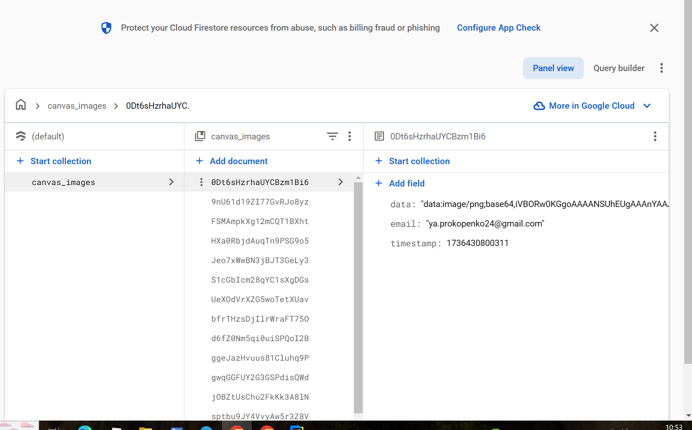
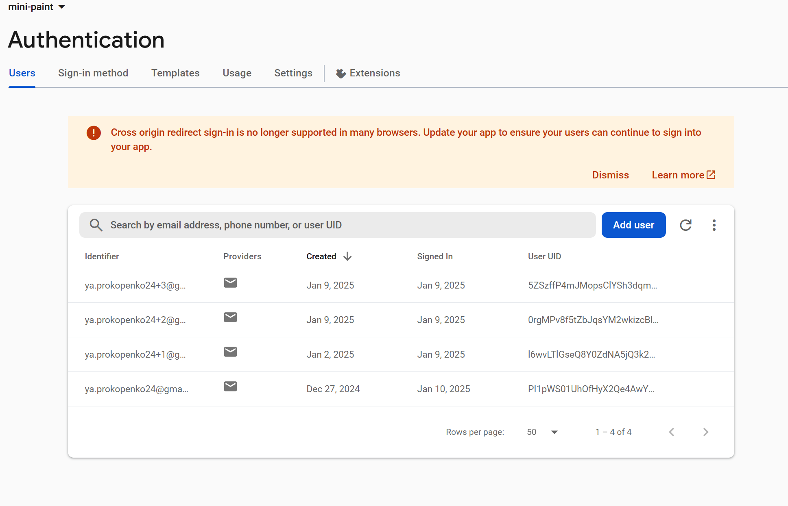

# **Mini-paint**

1. ### **Task** (https://drive.google.com/file/d/19cb4whI_HUVPzuaPyaj5r6hGotIVnhho/view).

This project implements functions such as drawing different shapes, choosing the color and thickness of the tool.
Theme management has also been implemented.

2. ### **How to run the app.**

* In the project directory, you can run:

##### **npm dev**

Runs the app in the development mode.
Open  http://localhost:5173/mini-paint/ to view it in the browser.

* To set up a production build, run the command:

##### **npm run build**

Link to application deployment (https://soneyk0.github.io/mini-paint/)

3.  ### **Database snapshot.**

4. ### **Application stack and description of the application structure.**

The project used technologies such as Vue, Vuex, Vite, Vue Router, Vue3-Toastify, firebase.

mini-paint
- src
    - appRoutes
        - router.js (Contains the routing logic, mapping paths to Vue components.)
    - assets (Folder for static assets (images)).
    - common (Folder for common components)
        - BaseButton.vue (Reusable button component)
        - BaseForm.vue (Reusable form component)
        - BaseInput.vue (Reusable component for data entry.)
    - components (Folder containing Vue components that are used in the app.)
        - AuthorizationForm.vue (A form component for user authentication (login).)
        - Editor.vue (Main mini-paint editor.)
        - HomePage.vue (The main page of the mini-paint.)
        - RegistrationForm.vue (A form component for user registration.)
        - Onboarding.vue (Onboarding with highlighting of elements and instructions.)
    - stepsStore
        - stepsStore.ts (A separate storage of onboarding steps that contains the logic for managing prompts.)
    - App.vue (The root Vue component that ties everything together.)
    - main.js (The entry point of the app, where Vue instance and plugins are initialized.)
    - styles.css (Global CSS styles for the app.)
    - index.html (The main HTML file, typically the starting point for the app)
    - store.ts (Vuex storage where data and the logic for managing it are stored.)
  
  

